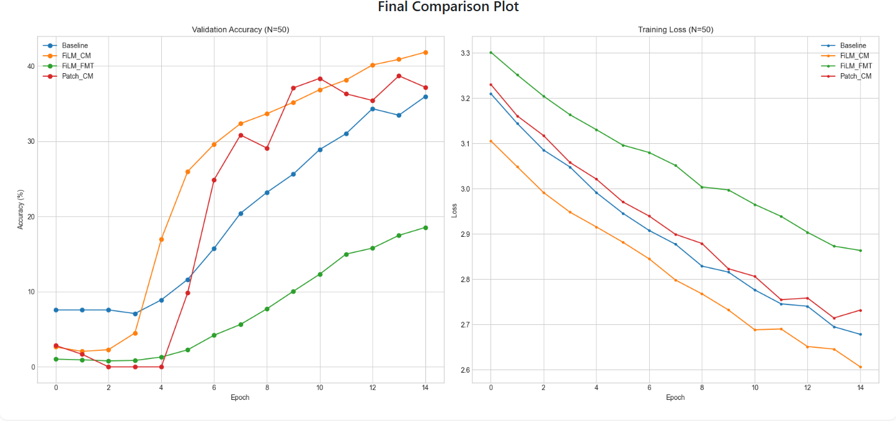
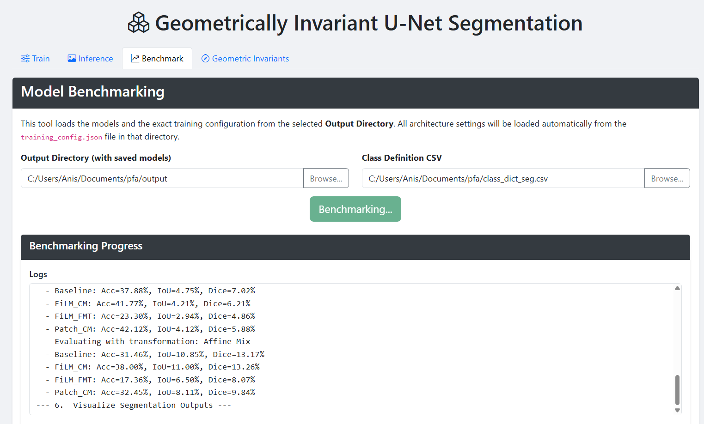
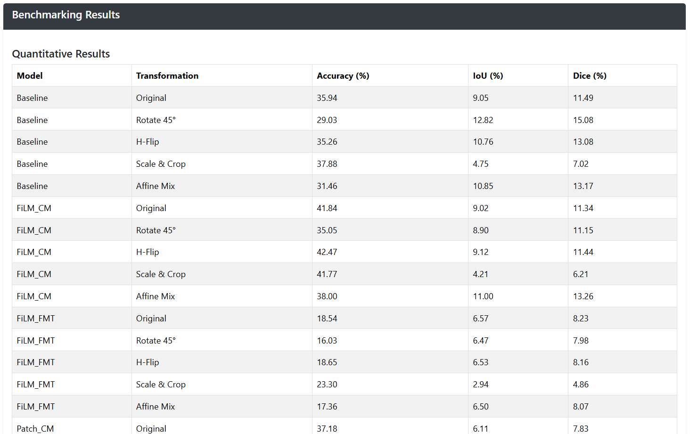
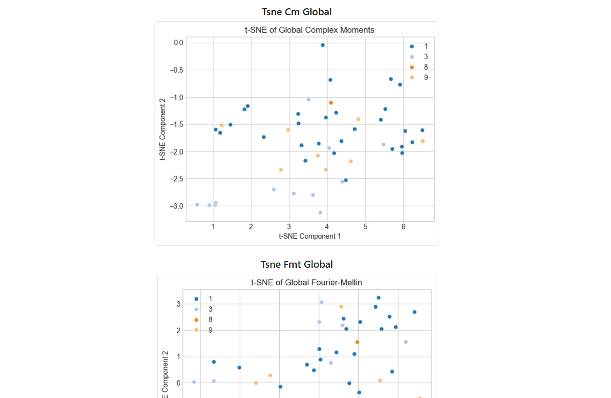
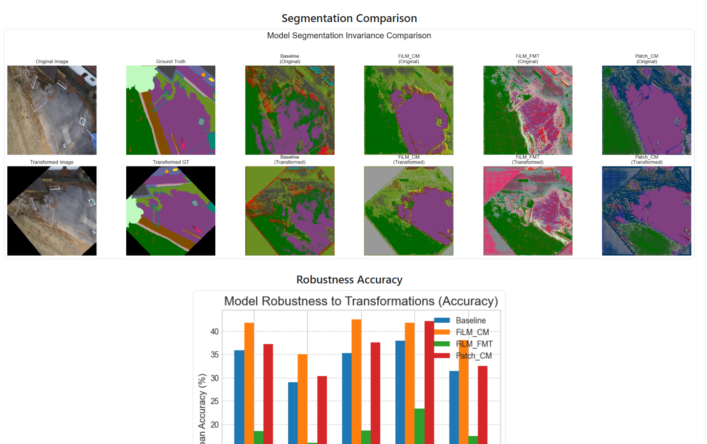
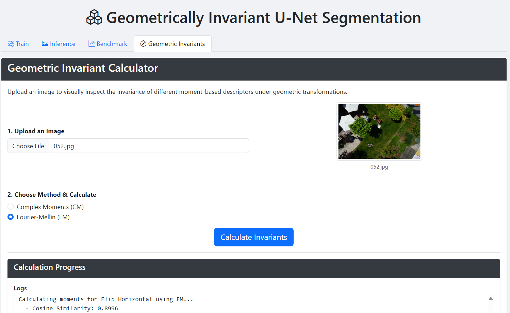

# Interactive Geometric Invariants Enhanced U-Net Models Training, Inference, and Benchmarking

This project provides a complete, browser-based graphical user interface (GUI) for an end-to-end semantic segmentation pipeline. It allows users to train, benchmark, and analyze deep learning models (U-Net and its Fourier-Mellin and Complex Moments enhanced variants) without writing any code or using the command line.

The application is built with **Python, Flask, and PyTorch** and features a multi-tabbed interface for:

1. **Training:** Configure datasets, set hyperparameters, and train multiple U-Net models in real-time.
2. **Benchmarking:** Evaluate trained models on various metrics (Accuracy, IoU, Dice) and test their robustness against geometric transformations.
3. **Inference:** Upload a single image and get an immediate visual segmentation from all trained models to qualitatively assess their performance.

4. **Geometric Invariants:** Visually explore the properties of moment-based image descriptors like Complex Moments and Fourier-Mellin moments.

---

## Table of Contents

- [Project Structure](#project-structure)
- [Setup and Installation](#setup-and-installation)
  - [Prerequisites](#prerequisites)
  - [Installation Steps](#installation-steps)
- [How to Use the Application](#how-to-use-the-application)
  - [Step 1: Launch the Application](#step-1-launch-the-application)
  - [Step 2: The "Train" Tab](#step-2-the-train-tab)
  - [Step 3: The "Inference" Tab](#step-3-the-inference-tab)
  - [Step 4: The "Benchmark" Tab](#step-4-the-benchmark-tab)
  - [Step 5: The "Geometric Invariants" Tab](#step-5-the-geometric-invariants-tab)
- [File and Folder Structure for Your Data](#file-and-folder-structure-for-your-data)
  - [Input Images](#input-images)
  - [RGB Masks](#rgb-masks)
  - [Class Definition CSV](#class-definition-csv)


---

## Project Structure

```text
/your_project_folder/
|-- app.py                   # Main Flask server and routes
|-- trainer.py               # Backend logic for the "Train" tab
|-- benchmarker.py           # Backend logic for the "Benchmark" tab
|-- geometricInvariants.py   # Backend logic for the "Invariants" tab
|-- requirements.txt         # Python dependencies
|-- README.md                # This file
|
|-- /templates/
|   |-- index.html           # Frontend UI (HTML)
|
|-- /static/
    |-- /css/
    |   |-- style.css        # Custom CSS styles
    |-- /js/
    |   |-- main.js          # Client-side JavaScript
    |-- /outputs/            # Auto-created: training/benchmarking plots
    |-- /uploads/            # Auto-created: images uploaded for invariants
```

---

## Setup and Installation

### Prerequisites

- **Python 3.8+**
- **Conda** (or another virtual environment manager, recommended)
- **CUDA-enabled GPU** (optional, but highly recommended for training)

### Installation Steps

1. **Clone the Repository**
   ```bash
   git clone <repository-url>
   cd <project-folder>
   ```

2. **Create a Virtual Environment**
   ```bash
   conda create -n geo_segmentation python=3.10
   conda activate geo_segmentation
   ```

3. **Install PyTorch**  
   Follow the official installation instructions: https://pytorch.org/get-started/locally/  
   Example for CUDA 11.8:
   ```bash
   pip install torch torchvision --index-url https://download.pytorch.org/whl/cu118
   ```

4. **Install Other Dependencies**
   ```bash
   pip install -r requirements.txt
   ```

---

## How to Use the Application

### Step 1: Launch the Application

From the project root:
```bash
python app.py
```

Open your browser (Chrome or Firefox) and go to:
```
http://127.0.0.1:5000
```

---

### Step 2: The "Train" Tab

- **Configure Paths:** Select Image Folder, Mask Folder, Class Definition CSV, and Output Directory.


- **Set Hyperparameters:** Adjust epochs, batch size, learning rate, image size, and data subset. Also parameters for the architecture of the U-net.

- **Preview Data (optional):** Check sample images and masks before training.


- **Start Training:** Progress logs and charts update in real time (validation accuracy, training loss).




---
### Step 3: The "Inference" Tab

- **Configure Paths:** Select the training output directory and Class Definition CSV and an input image.


- **Start Inference:** Run Inference with live logs.
- **View Results:**

  


---
### Step 4: The "Benchmark" Tab

- **Configure Paths:** Select the training output directory and Class Definition CSV.


- **Start Benchmarking:** Run evaluation with live logs.
- **View Results:**
  - Quantitative Results Table (Accuracy, IoU, Dice)
  

  - t-SNE plots of invariant features
  

  - Robustness charts under transformations
  - Segmentation comparison grids
  


---

### Step 5: The "Geometric Invariants" Tab

- **Upload an Image:** Supported formats: `.jpg`, `.png`
- **Choose Method:** Complex Moments or Fourier-Mellin
  

- **Calculate & Analyze:** View original + transformed images, plots of descriptors, and cosine similarity scores.
  
  

---


---

## File and Folder Structure for Your Data

### Input Images

- Folder with all training images (`.jpg`).
- Example: `C:/my_dataset/images/`

### RGB Masks

- Folder with segmentation masks (`.png`).
- Each pixel color corresponds to a class.
- Filenames must match the input images (e.g., `img_01.jpg` ↔ `img_01.png`).
- Example: `C:/my_dataset/masks/`

### Class Definition CSV

- CSV mapping classes to RGB values.
- Must include columns: `r, g, b`. Extra columns (like `name`) are allowed.

Example (`class_map.csv`):
```csv
name,r,g,b
background,0,0,0
water,0,0,255
building,255,0,0
vegetation,0,255,0
```


This web app was tested with https://www.kaggle.com/datasets/bulentsiyah/semantic-drone-dataset but it's generalizable to any semantic segmentation dataset with the same structure.
